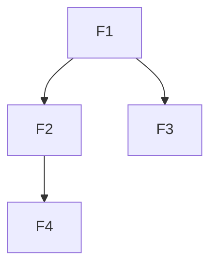

# FEAT-013: Formalize Architecture-to-WAVES Pipeline for Context Engineering

**Priority**: P1
**Component**: methodology
**Type**: new_feature
**Estimated Effort**: large
**Business Value**: high

## Overview

There is currently a gap in the context engineering methodology between having architecture documentation and having an ordered feature list ready for parallel development. The transformation from `ARCHITECTURE.md` + `PROJECT_SUMMARY.md` to `WAVES.md` is done ad-hoc through prompting, with no formalized process.

This feature creates a documented, repeatable pipeline with clear stages, inputs, outputs, and intermediate artifacts.

## Problem Statement

Current workflow:
1. Create ARCHITECTURE.md and PROJECT_SUMMARY.md through Deep Research phase
2. Ask Claude to "generate WAVES.md" in an ad-hoc manner
3. Manually review and adjust the waves

Issues with this approach:
- No structured extraction of features from architecture
- No explicit dependency analysis
- No intermediate artifacts for review
- Not reproducible or documentable
- Hard to debug when wave assignments are wrong
- No foundation for future automation

## Proposed Solution

Formalize a three-stage pipeline with intermediate artifacts:

```
ARCHITECTURE.md + PROJECT_SUMMARY.md
            |
    [Stage 1: Feature Enumeration]
    - Extract components from architecture
    - Extract interfaces between components
    - Extract user-facing capabilities
    - Extract cross-cutting concerns (config, logging, persistence)
            |
            v
    FEATURES.md (raw enumerated list)
            |
    [Stage 2: Dependency Analysis]
    - Data dependencies (A produces what B consumes)
    - Interface dependencies (A defines, B implements)
    - Runtime dependencies (A must exist for B to work)
            |
            v
    DEPENDENCIES.md (dependency graph)
            |
    [Stage 3: Wave Generation]
    - Topological sort of dependency graph
    - Group by depth level
    - Identify critical path
    - Balance wave sizes
            |
            v
    WAVES.md (ordered implementation plan)
```

## Benefits

1. **Repeatable Process**: Same inputs produce consistent outputs
2. **Clear Artifacts**: FEATURES.md and DEPENDENCIES.md provide review checkpoints
3. **Debuggable**: Can trace why a feature is in a particular wave
4. **Automatable**: Each stage has defined inputs/outputs suitable for tooling
5. **Parallel Development**: Enables git worktree strategy for wave-based development
6. **Methodology Integration**: Fits as Stage 2.5 between Deep Research and Implementation Planning

## Implementation Tasks

### Section 1: Define Stage 1 - Feature Enumeration

- [ ] Document feature extraction categories:
  - Core components from ARCHITECTURE.md
  - Interfaces and contracts between components
  - User-facing capabilities/commands
  - Cross-cutting concerns (configuration, logging, persistence, error handling)
  - External integrations (APIs, databases, file systems)
- [ ] Define FEATURES.md format with structured sections
- [ ] Create prompt template for Stage 1 extraction
- [ ] Document heuristics for feature granularity (not too big, not too small)

### Section 2: Define Stage 2 - Dependency Analysis

- [ ] Document dependency types:
  - **Data dependencies**: Feature A produces data that Feature B consumes
  - **Interface dependencies**: Feature A defines interface that Feature B implements
  - **Runtime dependencies**: Feature A must be running/exist for Feature B to work
  - **Optional dependencies**: Feature B is enhanced by Feature A but works without it
- [ ] Define DEPENDENCIES.md format (graph representation)
- [ ] Create prompt template for Stage 2 analysis
- [ ] Document cycle detection and resolution strategies

### Section 3: Define Stage 3 - Wave Generation

- [ ] Document topological sort algorithm for dependency graph
- [ ] Define wave grouping strategy (by depth level)
- [ ] Document critical path identification
- [ ] Define wave balancing heuristics (avoid single-feature waves, avoid massive waves)
- [ ] Define WAVES.md format with:
  - Wave number and summary
  - Features in wave with descriptions
  - Dependencies satisfied by prior waves
  - Parallel development notes
- [ ] Create prompt template for Stage 3 generation

### Section 4: Integration into Context Engineering Methodology

- [ ] Define where this fits in methodology (Stage 2.5)
- [ ] Document handoff from Deep Research (Stage 2) outputs
- [ ] Document handoff to Implementation Planning (Stage 3) inputs
- [ ] Create overview diagram showing full methodology flow

### Section 5: Create Templates and Examples

- [ ] Create FEATURES.md template with section headers and example entries
- [ ] Create DEPENDENCIES.md template with graph notation
- [ ] Create WAVES.md template (may already exist, verify/enhance)
- [ ] Create worked example from a real project (e.g., featmgmt itself)

### Section 6: Documentation

- [ ] Create pipeline overview document explaining all three stages
- [ ] Document each stage in detail with prompts, inputs, outputs
- [ ] Add to methodology documentation (if exists) or create standalone guide
- [ ] Document integration with git worktrees for parallel wave development

### Section 7: Verification

- [ ] Apply pipeline to a real project architecture
- [ ] Verify FEATURES.md captures all components
- [ ] Verify DEPENDENCIES.md correctly represents relationships
- [ ] Verify WAVES.md produces valid implementation order
- [ ] Compare to ad-hoc WAVES.md generation for quality

## Acceptance Criteria

- [ ] Stage 1 (Feature Enumeration) is documented with format, prompts, and examples
- [ ] Stage 2 (Dependency Analysis) is documented with format, prompts, and examples
- [ ] Stage 3 (Wave Generation) is documented with format, prompts, and examples
- [ ] Templates exist for FEATURES.md and DEPENDENCIES.md
- [ ] Pipeline fits into context engineering methodology documentation
- [ ] At least one worked example demonstrates full pipeline
- [ ] Documentation enables consistent, repeatable use of pipeline

## Artifact Specifications

### FEATURES.md Format

```markdown
# Features

## Core Components
| ID | Feature | Source | Description |
|----|---------|--------|-------------|
| F1 | feature-name | ARCHITECTURE.md#section | Brief description |

## Interfaces
| ID | Feature | Between | Description |
|----|---------|---------|-------------|
| F10 | interface-name | ComponentA <-> ComponentB | Contract description |

## User Capabilities
| ID | Feature | Command/Action | Description |
|----|---------|----------------|-------------|
| F20 | capability-name | user action | What user can do |

## Cross-Cutting Concerns
| ID | Feature | Scope | Description |
|----|---------|-------|-------------|
| F30 | concern-name | global/component | Infrastructure concern |
```

### DEPENDENCIES.md Format

```markdown
# Dependencies

## Dependency Graph

| Feature | Depends On | Type | Rationale |
|---------|------------|------|-----------|
| F2 | F1 | data | F2 consumes output of F1 |
| F3 | F1, F2 | interface | F3 implements interface defined by F1 |

## Dependency Visualization



## Cycles Detected
(none, or list with resolution strategy)
```

### WAVES.md Format (Enhanced)

```markdown
# Implementation Waves

## Wave 0: Foundation
**Theme**: Core infrastructure with no dependencies
**Parallel Development**: All features can be developed independently

| Feature | Description | Est. Effort |
|---------|-------------|-------------|
| F1 | ... | small |
| F5 | ... | medium |

## Wave 1: Core Logic
**Theme**: Business logic building on Wave 0
**Dependencies**: Requires Wave 0 complete
**Critical Path**: F2 -> F4 is on critical path

| Feature | Description | Depends On | Est. Effort |
|---------|-------------|------------|-------------|
| F2 | ... | F1 | medium |
| F3 | ... | F1, F5 | large |

(etc.)
```

## Notes

- This pipeline could eventually be automated with tooling
- Consider MCP server for dependency graph visualization
- Wave generation could use actual graph algorithms vs. heuristics
- Integration with featmgmt work items could auto-create features from FEATURES.md
