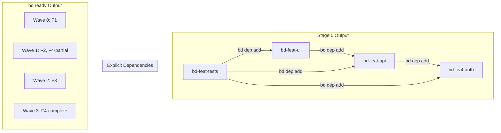

# FEAT-014: Context Engineering to Beads/Gastown Integration

**Priority**: P0
**Component**: methodology
**Type**: new_feature
**Estimated Effort**: large
**Business Value**: critical

## Overview

Transform the Context Engineering methodology from a document-centric, single-agent workflow into a beads-native, multi-agent system compatible with Gastown orchestration. This enables parallel agent execution, automatic dependency resolution via `bd ready`, and persistent work state that survives agent crashes.

## Problem Statement

Current Context Engineering methodology:
1. Uses directory-based work items (`features/FEAT-XXX/PROMPT.md`)
2. Manually generates WAVES.md for implementation ordering
3. Single-agent execution per stage
4. Work state lives in markdown files, not queryable
5. No integration with Gastown's GUPP propulsion system
6. Dependencies are implicit (inferred from WAVES.md) not explicit

Limitations:
- Cannot leverage `bd ready` for automatic unblocked work detection
- No `gt sling` integration for agent assignment
- Missing explicit dependency graph for topological sorting
- Cannot scale to 20-30 parallel agents
- Work doesn't survive context window exhaustion

## Proposed Solution

Implement full MEOW stack integration:

```
┌─────────────────────────────────────────────────────────────────────────┐
│                    CONTEXT ENGINEERING → MEOW MAPPING                    │
├─────────────────────────────────────────────────────────────────────────┤
│                                                                         │
│  CURRENT (featmgmt)              TARGET (beads/gastown)                 │
│  ─────────────────               ─────────────────────                  │
│                                                                         │
│  Stage 1-6 (manual)      →       Formula (context-engineering.toml)     │
│  PROMPT.md files         →       Bead bodies (bd create --body)         │
│  Directory structure     →       Epic hierarchy (bd-xxxx.1, bd-xxxx.2)  │
│  WAVES.md (manual)       →       bd dep add + bd ready (automatic)      │
│  OVERPROMPT.md           →       GUPP hooks + gt sling                  │
│  Single agent            →       Polecat swarm via Gastown              │
│                                                                         │
└─────────────────────────────────────────────────────────────────────────┘
```

## Architecture

### Formula Structure

```
.beads/formulas/
├── context-engineering.formula.toml      # Master pipeline formula
├── ce-stage-1-ideation.formula.toml      # Per-stage formulas
├── ce-stage-2-research.formula.toml
├── ce-stage-3-parsing.formula.toml
├── ce-stage-4-architecture.formula.toml
├── ce-stage-5-features.formula.toml      # Generates beads with deps
└── ce-stage-6-implementation.formula.toml
```

### Bead Hierarchy

```
bd-proj (Epic: Project X)
├── bd-proj.1 (Stage 1: Ideation)
│   └── bd-proj.1.1 (Deep Research Prompt)
├── bd-proj.2 (Stage 2: Deep Research)
│   ├── bd-proj.2.1 (Gemini Research)
│   ├── bd-proj.2.2 (ChatGPT Research)
│   └── bd-proj.2.3 (Claude Research)
├── bd-proj.3 (Stage 3: Document Parsing)
│   └── bd-proj.3.1 (SYNTHESIS.md)
├── bd-proj.4 (Stage 4: Architecture)
│   ├── bd-proj.4.1 (ARCHITECTURE.md)
│   └── bd-proj.4.2 (PROJECT_SUMMARY.md)
├── bd-proj.5 (Stage 5: Feature Generation)
│   └── [generates feature beads with dependencies]
└── bd-proj.6 (Stage 6: Implementation)
    └── [populated by bd ready from Stage 5 output]
```

### Dependency Flow



## Implementation Tasks

### Section 1: Create Master Formula

- [ ] Create `context-engineering.formula.toml` with all 6 stages
- [ ] Define stage dependencies (each stage needs previous)
- [ ] Define variables: `project_name`, `project_description`, `research_sources`
- [ ] Add pre-flight checks (verify beads initialized, gastown available)
- [ ] Add post-flight hooks (summarize artifacts created)

**Formula Template:**
```toml
description = "Context Engineering Pipeline - Spec-Driven Development"
formula = "context-engineering"
version = 1

[vars.project_name]
description = "Name of the project"
required = true

[vars.project_description]
description = "Brief project description for research prompt"
required = true

[[steps]]
id = "ideation"
title = "Stage 1: Ideation"
description = "Generate deep research prompt via conversational exploration"
creates = ["deep-research-prompt.md"]

[[steps]]
id = "deep-research"
title = "Stage 2: Deep Research"
description = "Run deep research on Gemini, ChatGPT, Claude"
needs = ["ideation"]
creates = ["docs/research/*.md"]
parallel = true  # All three can run simultaneously

[[steps]]
id = "parsing"
title = "Stage 3: Document Parsing"
description = "Parse research docs, generate SYNTHESIS.md"
needs = ["deep-research"]
creates = ["docs/research/SYNTHESIS.md"]

[[steps]]
id = "architecture"
title = "Stage 4: Architecture Generation"
description = "Generate ARCHITECTURE.md and PROJECT_SUMMARY.md"
needs = ["parsing"]
creates = ["docs/ARCHITECTURE.md", "docs/PROJECT_SUMMARY.md"]

[[steps]]
id = "feature-gen"
title = "Stage 5: Feature Generation"
description = "Decompose into beads with explicit dependencies"
needs = ["architecture"]
creates = ["beads:bd-*.features"]
generates_beads = true

[[steps]]
id = "implementation"
title = "Stage 6: Implementation"
description = "Execute via bd ready + gt sling loop"
needs = ["feature-gen"]
loop = true
exit_condition = "bd ready --count == 0"
```

### Section 2: Implement Stage 5 Bead Generator

- [ ] Create `ce-stage-5-features.formula.toml` with detailed steps
- [ ] Implement feature extraction from ARCHITECTURE.md (per FEAT-013)
- [ ] Implement dependency analysis algorithm
- [ ] Generate `bd create` commands with `--body` containing PROMPT.md content
- [ ] Generate `bd dep add` commands for all dependencies
- [ ] Output machine-readable manifest of created beads

**Stage 5 Sub-steps:**
```toml
[[steps]]
id = "extract-features"
title = "Extract Features from Architecture"
description = """
Parse ARCHITECTURE.md to extract:
- Core components
- Interfaces between components
- User-facing capabilities
- Cross-cutting concerns
"""

[[steps]]
id = "analyze-dependencies"
title = "Analyze Feature Dependencies"
needs = ["extract-features"]
description = """
For each feature, determine:
- Data dependencies (produces/consumes)
- Interface dependencies (defines/implements)
- Runtime dependencies (requires existence)
"""

[[steps]]
id = "create-beads"
title = "Create Feature Beads"
needs = ["analyze-dependencies"]
description = """
For each feature:
  bd create "{{feature.title}}" \
    --type feature \
    --priority {{feature.priority}} \
    --parent {{epic_id}} \
    --body "$(cat <<'EOF'
{{feature.prompt_content}}
EOF
)"
"""

[[steps]]
id = "establish-dependencies"
title = "Establish Bead Dependencies"
needs = ["create-beads"]
description = """
For each dependency relationship:
  bd dep add {{child_id}} {{parent_id}} --type {{dep_type}}
"""
```

### Section 3: Implement Stage 6 Gastown Integration

- [ ] Create `ce-stage-6-implementation.formula.toml`
- [ ] Implement `bd ready` → `gt sling` loop
- [ ] Define polecat spawning strategy (parallel count, resource limits)
- [ ] Implement convoy creation for batch assignments
- [ ] Add witness monitoring for stuck agents
- [ ] Implement completion detection and bead closing

**Stage 6 Loop:**
```bash
# The GUPP Loop
while true; do
    # Get unblocked work
    ready=$(bd ready --json)

    if [ "$(echo $ready | jq length)" -eq 0 ]; then
        echo "All work complete"
        break
    fi

    # Create convoy for batch
    convoy_id=$(gt convoy create "Wave $(date +%s)" --json | jq -r .id)

    # Sling each ready item to a polecat
    echo $ready | jq -r '.[].id' | while read bead_id; do
        gt sling $bead_id --convoy $convoy_id
    done

    # Wait for convoy completion
    gt convoy wait $convoy_id

    # Close completed beads
    gt convoy show $convoy_id --json | jq -r '.completed[].bead_id' | while read id; do
        bd close $id
    done
done
```

### Section 4: Create Migration Tool

- [ ] Create `scripts/migrate-featmgmt-to-beads.sh`
- [ ] Parse existing `features/*/PROMPT.md` files
- [ ] Extract implicit dependencies from WAVES.md if present
- [ ] Generate `bd create` commands for each feature
- [ ] Generate `bd dep add` commands for dependencies
- [ ] Preserve metadata (priority, component, effort)
- [ ] Create migration report

**Migration Script Interface:**
```bash
./scripts/migrate-featmgmt-to-beads.sh \
    --source /path/to/feature-management \
    --epic "Project Migration" \
    --waves /path/to/WAVES.md \      # Optional: extract deps from waves
    --dry-run                         # Preview commands without executing
```

### Section 5: Update CLAUDE.md Instructions

- [ ] Add beads workflow section to methodology CLAUDE.md
- [ ] Document `bd` commands for each stage
- [ ] Document `gt` commands for Stage 6
- [ ] Add troubleshooting for common issues
- [ ] Update quick reference card with beads commands

### Section 6: Create Agent Role Prompts

- [ ] Create Mayor prompt for Context Engineering oversight
- [ ] Create Polecat prompt template for feature implementation
- [ ] Create Witness prompt for monitoring implementation quality
- [ ] Define hook content format for each role
- [ ] Integrate with existing featmgmt agent prompts

**Mayor Context Engineering Prompt:**
```markdown
# Mayor: Context Engineering Orchestrator

You are managing a Context Engineering pipeline for {{project_name}}.

## Current State
- Pipeline stage: {{current_stage}}
- Active molecules: {{active_molecules}}
- Ready beads: {{bd_ready_count}}
- In-progress beads: {{in_progress_count}}

## Your Responsibilities
1. Monitor pipeline progression through stages
2. Spawn polecats for Stage 6 implementation
3. Handle blocked work and dependency issues
4. Report progress to the Overseer (human)

## Commands Available
- `bd ready` - Show unblocked work
- `bd list --status open` - Show all open beads
- `gt sling <bead-id>` - Assign work to polecat
- `gt convoy create` - Batch work items
- `bd close <bead-id>` - Mark work complete
```

### Section 7: Implement SYNTHESIS.md → Beads Bridge

- [ ] Create parser for SYNTHESIS.md format
- [ ] Extract key decisions as potential beads
- [ ] Link decisions to architecture sections
- [ ] Enable traceability from research to features

### Section 8: Testing and Validation

- [ ] Apply pipeline to a real project (featmgmt itself or new project)
- [ ] Validate Stage 5 generates correct bead hierarchy
- [ ] Validate dependencies produce correct `bd ready` ordering
- [ ] Validate Stage 6 loop completes all work
- [ ] Compare output quality to manual WAVES.md approach
- [ ] Benchmark: time to complete vs single-agent

## Acceptance Criteria

- [ ] Master formula `context-engineering.formula.toml` exists and executes
- [ ] Stage 5 generates beads with explicit dependencies from architecture
- [ ] `bd ready` produces equivalent ordering to manual WAVES.md
- [ ] Stage 6 integrates with `gt sling` for parallel execution
- [ ] Migration script converts existing featmgmt projects
- [ ] CLAUDE.md updated with beads/gastown workflow
- [ ] At least one project successfully completed using new pipeline
- [ ] Documentation enables adoption by other users

## Dependencies

- FEAT-013 (Architecture-to-WAVES Pipeline) - concepts feed into Stage 5
- Beads 0.44.0+ installed
- Gastown installed and configured
- Gastown rig created for target project

## Risks and Mitigations

| Risk | Mitigation |
|------|------------|
| Beads/Gastown APIs change | Pin to specific versions, abstract behind scripts |
| Dependency inference inaccurate | Allow manual override via `--deps` flag |
| Too many parallel agents overwhelm | Configurable concurrency limit in formula |
| Context window still exhausts | GUPP ensures work persists on hooks |

## Future Enhancements

- MCP server for real-time dependency graph visualization
- Auto-generate beads from natural language project description
- Integration with git worktrees for wave-based parallel development
- Cost tracking and optimization for agent usage
- Federation support for distributed teams

## References

- [Welcome to Gas Town](https://scribe.rip/welcome-to-gas-town-4f25ee16dd04) - Steve Yegge
- [The Future of Coding Agents](https://scribe.rip/the-future-of-coding-agents-e9451a84207c) - Steve Yegge
- [Beads Documentation](https://github.com/steveyegge/beads)
- [Gastown Documentation](https://github.com/steveyegge/gastown)
- FEAT-013: Architecture-to-WAVES Pipeline
- CONTEXT_ENGINEERING_METHODOLOGY.md
